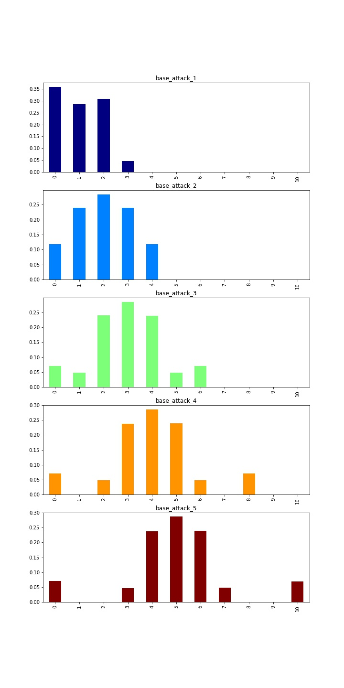

# Gloomhaven Damage Simulator

Attack modifier deck simulator and probability calculator for the popular board game and Steam game Gloomhaven. The probablity calculations are non-trivial given the re-shuffling logic.

Here's an example of the calculated probabilities for the base modifier deck:

<h3 align=left> Attack PDFs </h3>

<h3 align=left> Attack CDF Table </h3>

<table border="0" class="table">
  <thead>
    <tr style="text-align: right;">
      <th></th>
      <th>base_attack_1</th>
      <th>base_attack_2</th>
      <th>base_attack_3</th>
      <th>base_attack_4</th>
      <th>base_attack_5</th>
    </tr>
  </thead>
  <tbody>
    <tr>
      <th>0</th>
      <td>0.3585</td>
      <td>0.1209</td>
      <td>0.0715</td>
      <td>0.0714</td>
      <td>0.0700</td>
    </tr>
    <tr>
      <th>1</th>
      <td>0.6405</td>
      <td>0.3526</td>
      <td>0.1204</td>
      <td>0.0714</td>
      <td>0.0700</td>
    </tr>
    <tr>
      <th>2</th>
      <td>0.9545</td>
      <td>0.6377</td>
      <td>0.3611</td>
      <td>0.1172</td>
      <td>0.0700</td>
    </tr>
    <tr>
      <th>3</th>
      <td>1.0000</td>
      <td>0.8800</td>
      <td>0.6474</td>
      <td>0.3532</td>
      <td>0.1181</td>
    </tr>
    <tr>
      <th>4</th>
      <td>1.0000</td>
      <td>1.0000</td>
      <td>0.8812</td>
      <td>0.6437</td>
      <td>0.3534</td>
    </tr>
    <tr>
      <th>5</th>
      <td>1.0000</td>
      <td>1.0000</td>
      <td>0.9309</td>
      <td>0.8817</td>
      <td>0.6410</td>
    </tr>
    <tr>
      <th>6</th>
      <td>1.0000</td>
      <td>1.0000</td>
      <td>1.0000</td>
      <td>0.9278</td>
      <td>0.8788</td>
    </tr>
    <tr>
      <th>7</th>
      <td>1.0000</td>
      <td>1.0000</td>
      <td>1.0000</td>
      <td>0.9278</td>
      <td>0.9274</td>
    </tr>
    <tr>
      <th>8</th>
      <td>1.0000</td>
      <td>1.0000</td>
      <td>1.0000</td>
      <td>1.0000</td>
      <td>0.9274</td>
    </tr>
    <tr>
      <th>9</th>
      <td>1.0000</td>
      <td>1.0000</td>
      <td>1.0000</td>
      <td>1.0000</td>
      <td>1.0000</td>
    </tr>
    <tr>
      <th>10</th>
      <td>1.0000</td>
      <td>1.0000</td>
      <td>1.0000</td>
      <td>1.0000</td>
      <td>1.0000</td>
    </tr>
  </tbody>
</table>
